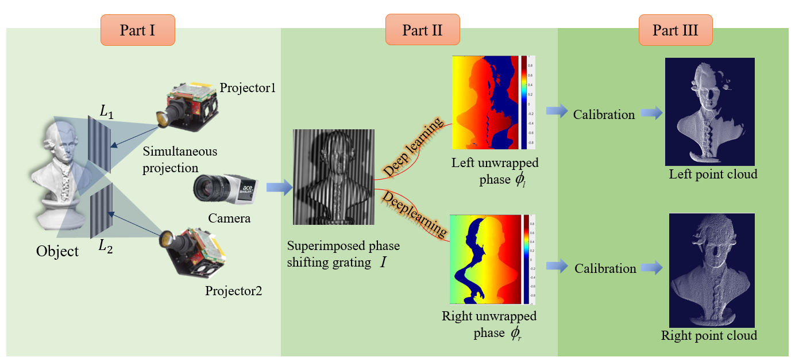
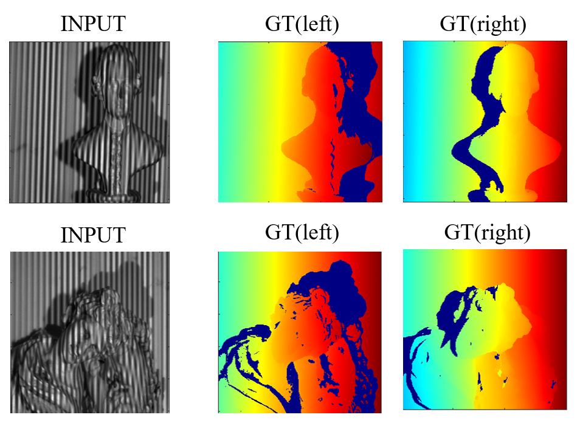
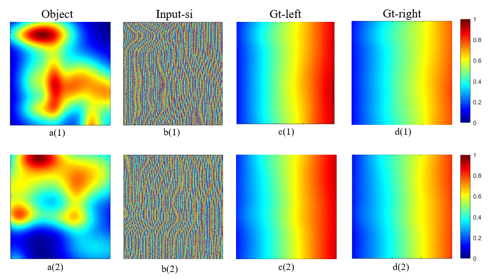

# DPSL3D-measurement

<div align="center">

<h1> Real and Simulation Dataset for One-Shot 3D Reconstruction of a Dual-Projector System </h1>

<div>
    <p> <b>Tsinghua SIGS</b> </p>
</div>



</div>

## Introduction
- Our dataset is designed for the field of rapid, large-scale, and high-precision 3D measurement using dual projectors in structure light techniques. With the utilization of this dataset, we aim to facilitate research and development in the area of efficient and wide range three-dimensional reconstruction at a fast speed and high level of precision. In the real dataset, there are ~900 image pairs images in the training dataset, and  ~80 image pairs in testing dataset with the size of 640 × 512 pixels. It contains more than 200 plaster statues, wooden objects, and polystyrene artifacts, including basic geometric shapes (spheres, triangle pyramids, prisms), abundant human statues, and animal statues in combination. In the DPSL3D-measurement dataset, the input is the one-shot superimposed grating image obtained by simultaneous projection of two projectors. And the ground truth is the unwrapped phase when the projectors project in turn.

  
  
- There are ~3000 image pairs (with 256 × 256 pixels) in simulation training dataset and ~300 image pairs (with 256 × 256 pixels) in simulation test datasets. A single-shot high frequency superimposed phase shifting grating captured by the camera in the case of simultaneous projection of dual projectors is used as the input of the simulation dataset. And the ground truth is the unwrapped phase when the projectors project in turn. Simulation objects are unique Gaussian surfaces with heights ranging from 0 to 60 millimeters.

  


## Updates
- [08/2023] We will continue to update the data set and related research. Stay tuned!

## Usage
### The dataset can be directly downloaded from the following links.
DPSL3D-measurement1.0 [GoogleDrive](https://drive.google.com/drive/folders/1na2IJbPW4mSYdtrdPQg7x7WVGhP_onGu?usp=sharing)

Note again that by downloading the dataset you acknowledge that you have read the agreement, understand it, and agree to be bound by them. If you do not agree with these terms and conditions, you must not download and/or use the Dataset.

### Dataset format
```
.
├── double_projectors_real_dataset
    ├── train
    └── test
        ├──inpout
        └──gt
           ├──left
           └──right
              ├── 000001.mat
              ├── 000002.mat 
              ├── 000003.mat
              ├── ... 
              └── 0000050.mat 
               ```             
├── double_projectors_simulation_dataset
    ├── train
    └── test
        ├──inpout
        ├──gt
           ├──left
           ├──right
              ├── 000001.mat
              ├── 000002.mat 
              ├── 000003.mat
              ├── ... 
              └── 0000050.mat 
               ```     


## Agreement
The DPSL3D-measurement dataset is available for non-commercial research purposes only. The Dataset may not be reproduced, modified and/or made available in any form to any third party without Author’s prior written permission.

You agree not to reproduce, modified, duplicate, copy, sell, trade, resell or exploit any portion of the images and any portion of derived data in any form to any third party without author’s prior written permission.

You agree not to further copy, publish or distribute any portion of the Dataset. Except, for internal use at a single site within the same organization it is allowed to make copies of the dataset.

Authors reserves the right to terminate your access to the Dataset at any time.

## More informarion
Details about the code and dataset can be found in this paper. 

## Contact
- Yiming Li (iyiming21@mails.tsinghua.edu.cn)
